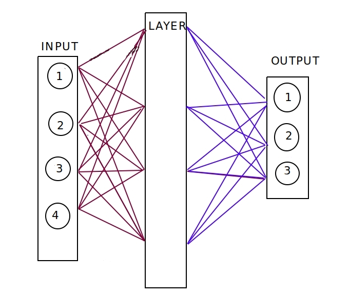

# Implementation of multilayer perceptron in pure C++

> Based on [15 Steps to Implement a Neural Net](http://code-spot.co.za/2009/10/08/15-steps-to-implemented-a-neural-net/) and 
[Using neural nets to recognize handwritten digits](http://neuralnetworksanddeeplearning.com/chap1.html)


## Simple architecture for predicting **Iris** species (one or more hidden layers is possible)



## Example

```cpp
// before load data and encode labels into onehotEncoder...
auto trainTest = trainTestSplit(data, 0.2);
auto trainData = std::get<0>(trainTest);
auto testData = std::get<1>(trainTest);

std::vector<int> sizes = {4, 8, 3};
NeuralNet nn(sizes);

int epochs = 10
int miniBatchSize = 4
double eta = 0.1 // learning rate
nn.SGD(trainData, epochs, miniBatchSize, eta, testData);

double accuracy = nn.accuracy(testData);
std::cout << "Accuracy: " << accuracy << std::endl;

auto confusionMatrix = nn.confusionMatrix(testData);
std::cout << "Confunsion matrix" << std::endl;
std::cout << confusionMatrix << std::endl;
```

Output:
```
Epoch: 1/10 complete    Test loss: 0.149012
Epoch: 2/10 complete    Test loss: 0.139139
Epoch: 3/10 complete    Test loss: 0.134284
Epoch: 4/10 complete    Test loss: 0.129532
Epoch: 5/10 complete    Test loss: 0.125607
Epoch: 6/10 complete    Test loss: 0.121967
Epoch: 7/10 complete    Test loss: 0.118834
Epoch: 8/10 complete    Test loss: 0.115805
Epoch: 9/10 complete    Test loss: 0.113544
Epoch: 10/10 complete   Test loss: 0.11129

Accuracy: 0.8667

Confunsion matrix
10 0 0 
0 6 3 
0 1 10
```


## Setup and run
_tested on Ubuntu 18.04.2 LTS_

To clean cmake, rebuild project and run program with default parameters
```bash
./run.sh
```
Example (let's say I'm in main folder)
```bash
file=$(pwd)"/iris.data"
epochs=100
miniBatch=2
learningRate=0.1

bin/neuralnet $file $epochs $miniBatch $learningRate
```


## Comparision to `PyTorch` and `Keras`

Look at **jupyter_notebooks** directory


**TODO**
- extend file loader to be able to load any dataset
